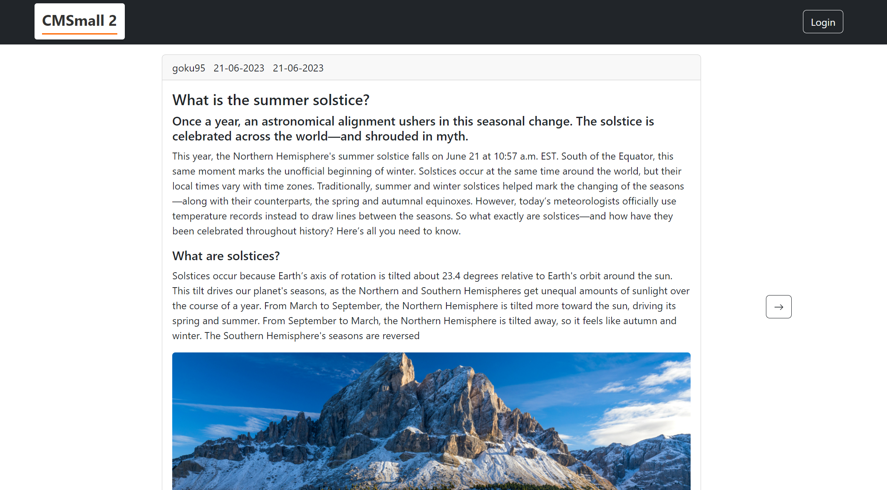
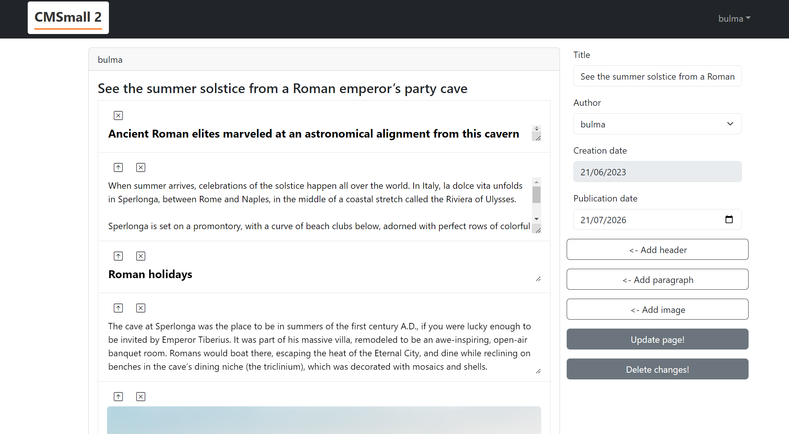
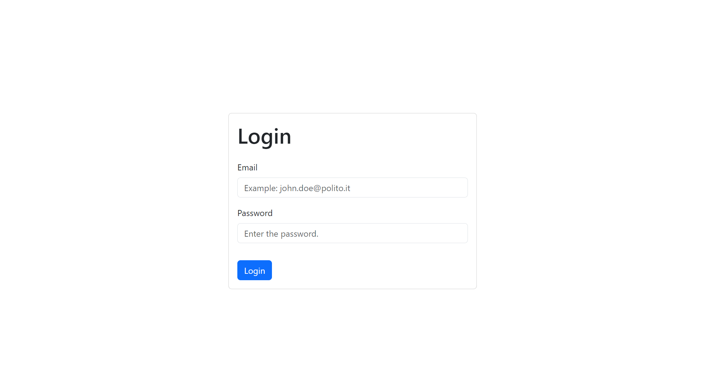

[](https://classroom.github.com/a/8AapHqUJ)
# Exam #1: "CMSmall"
Design and implement a web application for a small Content Management System (CMS) where users can create, post, modify and delete pages.

grade: 30 lode out of 30

## React Client Application Routes

- Route `/`: homepage; show list of posted pages 
- Route `/add`: user create a new page
- Route `/edit`: user modify a page 
- Route `/area`: back-office/personal area for logged user where can see all pages
- Route `/login`: for user login, performe authentication 
- Route `/settings`: for the admin to modify settings of the site, in this case the name 
- Route `*`: page not found

## API Server

### Page Managment

#### Get pages

* HTTP method: `GET`  URL: `/api/pages`
* Description: Get the full list of pages. Require logged user. The array of object that describe the contents of the page are order like in the meaning of the page, while the pages are not sorted.
* Request body: _None_
* Request query parameter: _none_
* Response: `200 OK` (success)
* Response body: Array of objects, each describing one page:

``` json
[
  {
    "id": 1,
    "title": "The Pacific Ocean, explained",
    "authorId": 1,
    "authorName": "goku95",
    "dateOfCreation": "2023-03-17",
    "dateOfPublication": "2023-03-17",
    "contents": [
      {
        "id": 1,
        "type": "header",
        "value": "The Ring of Fire",
        "order": 0
      },
      {
        "id": 2,
        "type": "paragraph",
        "value": "Here the paragraph...",
        "order": 1
      },
      {
        "id": 3,
        "type": "image",
        "value": "4",
        "order": 2
      }
      ...
    ]
  },
  ...
]
```

* Error responses:  `500 Internal Server Error` (generic error)

### Get one page given id

* HTTP method: `GET`  URL: `/api/pages/:id`
* Description: Get a page given its id. Require logged user
* Request body: _None_
* Response: `200 OK` (success)
* Response body: a objects, describing one page:

``` json
{
    "id": 1,
    "title": "The Pacific Ocean, explained",
    "authorId": 1,
    "authorName": "goku95",
    "dateOfCreation": "2023-03-17",
    "dateOfPublication": "2023-03-17",
    "contents": [
      {
        "id": 1,
        "type": "header",
        "value": "The Ring of Fire",
        "order": 0
      },
      {
        "id": 2,
        "type": "paragraph",
        "value": "Here the paragraph...",
        "order": 1
      },
      {
        "id": 3,
        "type": "image",
        "value": "4",
        "order": 2
      }
      ...
    ]
 }
```

* Error responses:  `500 Internal Server Error` (generic error)

#### Get posted pages

* HTTP method: `GET`  URL: `/api/posted/pages`
* Description: Get the full list of pages. Not require logged user
* Request body: _None_
* Request query parameter: _none_
* Response: `200 OK` (success)
* Response body: Array of objects, each describing one page:

``` json
[
  {
    "id": 1,
    "title": "The Pacific Ocean, explained",
    "authorId": 1,
    "authorName": "goku95",
    "dateOfCreation": "2023-03-17",
    "dateOfPublication": "2023-03-17",
    "contents": [
      {
        "id": 1,
        "type": "header",
        "value": "The Ring of Fire",
        "order": 0
      },
      {
        "id": 2,
        "type": "paragraph",
        "value": "Here the paragraph...",
        "order": 1
      },
      ...
    ]
  },
  ...
]
```

* Error responses:  `500 Internal Server Error` (generic error)

#### Add page

* HTTP method: `POST`  URL: `/api/pages`
* Description: Add a new page. Require logged user. 
* Request body: 
``` JSON
{
    "id": 1,
    "title": "The Pacific Ocean, explained",
    "authorId": 1,
    "dateOfCreation": "2023-03-17",
    "dateOfPublication": "2023-03-17",
    "contents": [
      {
        "type": "header",
        "value": "The Ring of Fire",
        "order": 0
      },
      {
        "type": "paragraph",
        "value": "Here the paragrph...",
        "order": 1
      },
      ...
    ]
}
``` 
* Response: `200 OK` (success)
* Response body: _None_
* Error responses: `503 Service Unavailable` (database error), `400 wrong body`

#### Modify page

* HTTP method: `POST`  URL: `/api/pages/:id`
* Description: Update values an existing page, deleting the old one and replacing with the newest. Require logged user. The permission on the page is also checked.
* Request body: description of the object to update
``` JSON
{
    "id": 1,
    "title": "The Pacific Ocean, explained",
    "authorId": 1,
    "dateOfCreation": "2023-03-17",
    "dateOfPublication": "2023-03-17",
    "contents": [
      {
        "id": 1,
        "type": "header",
        "value": "The Ring of Fire",
        "order": 0
      },
      {
        "id": 2,
        "type": "paragraph",
        "value": "Here the paragrph...",
        "order": 1
      },
      ...
    ]
}
``` 
* Response: `200 OK` (success)
* Response body: _None_

* Error responses: `503 Service Unavailable` (database error)

#### Delete page

* HTTP method: `DELETE`  URL: `/api/pages/:id`
* Description: Delete an existing page. Require logged user. The permission on the page is also checked.
* Request body: _None_

* Response: `200 OK` (success)
* Response body: _None_

* Error responses:  `503 Service Unavailable` (database error)

### Site-System Managment

#### Get title site

* HTTP method: `GET`  URL: `/api/title`
* Description: Get the title information of the site
* Request body: _None_

* Response: `200 OK` (success)
* Response body: 
``` JSON
{
  "name" : "CMSmall"
}
``` 

* Error responses: `500 Internal Server Error` (generic error)

#### Modify title site

* HTTP method: `PUT`  URL: `/api/title`
* Description: Modify the title of the site. Require admin permission.
* Request body: 
``` JSON
{
  "name" : "CMSmall 2"
}
``` 
* Response: `200 OK` (success)
* Response body: an object that rapresent the new title
``` JSON
{
  "name" : "CMSmall 2"
}
``` 

* Error responses: `500 Internal Server Error` (generic error)

### User Managment

#### Get all users

* HTTP method: `GET`  URL: `/api/users`
* Description: Get the full list of users. Require admin permission.
* Request body: _None_
* Request query parameter: _None_
* Response: `200 OK` (success)
* Response body: 

``` json
[
  {
    "id": 1,
    "username": "gerer@email.com",
    "name": "goku95",
    "admin": 0
  },
  {
    "id": 18,
    "username": "uyr@email.com",
    "name": "mario",
    "admin": 0
  }
  ...
]
```

* Error responses:  `500 Internal Server Error` (generic error)

#### Login

* HTTP method: `POST`  URL: `/api/sessions`
* Description: authenticate the user who is trying to login
* Request body: credentials of the user who is trying to login

``` JSON
{
    "username": "username",
    "password": "password"
}
```

* Response: `200 OK` (success)
* Response body: authenticated user

``` JSON
{
    "id": 1,
    "username": "john.doe@polito.it", 
    "name": "John",
    "admin": 0
}
```

* Error responses:  `500 Internal Server Error` (generic error), `401 Unauthorized User` (login failed)

#### Check if user is logged in

* HTTP method: `GET`  URL: `/api/sessions/current`
* Description: check if current user is logged in and get her data
* Request body: _None_
* Response: `200 OK` (success)

* Response body: authenticated user

``` JSON
{
    "id": 1,
    "username": "john.doe@polito.it", 
    "name": "John",
    "admin": 0
}
```

* Error responses: `500 Internal Server Error` (generic error), `401 Unauthorized User` (user is not logged in)

#### Logout

* HTTP method: `DELETE`  URL: `/api/sessions/current`
* Description: logout current user
* Request body: _None_
* Response: `200 OK` (success)

* Response body: _None_

* Error responses: `500 Internal Server Error` (generic error), `401 Unauthorized User` (user is not logged in)

### Others

#### Get Images

* HTTP method: `GET`  URL: `/api/images`
* Description: Get the full list of names of the images file that are in the static folder `/static`. So you can get them from `/static/imagename`
* Request body: _None_
* Request query parameter: _none_
* Response: `200 OK` (success)
* Response body: Array of strings, names of images:

``` json
[
  "image1.jpg",
  "image2.jpg",
  ...
]
```

* Error responses:  `500 Internal Server Error` (generic error)

## Database Tables

- Table `pages` - contains id, title, authorId(foreign key of users), dateOfCreation, dateOfPublication
- Table `contents` - contains id, pageId(foreign key of pages), nOrder, type, value
- Table `users` - contains id, email, name, hash, salt, admin
- Table `system_settings` - contains name

## Main React Components

- `LoginForm` (in `Auth.jsx`): form for login
- `NavHeaderMain` (in `Auth.jsx`): the default navbar of the app. Has some buttons for navigate between routes: home(clicking the logo), login, logout, back-office and settings
- `PageComponent` (in `PageComponents.jsx`): the main component for the pages view, both for only the posted one in front office than alls int the back-office. This component manage the layout showing a one centered page at time with buttons to slide to the next of previus. If we are in the backoffice supplementing component are visualized like modify, delete and create page button. Use the OnePageComponent.  
- `OnePageComponent` (in `PageComponents.jsx`): this component rapresent the single page, use singleContentBlock to assemble itself.
- `SingleContentBlock` (in `PageComponents.jsx`): The page is composed of content (header,paragraph, image), this component rapresent them.
- `EditPageComponent` (in `PageComponents.jsx`): This rapresent the view of the single page editing. On the right there is a form with: title, dates and in some cases users. 3 button each to add a content: header, paragrapg and image, then a submitform and cancel button to undo the operations. In the center is visualized the page. The contents are EditSingleContentBlock component. To choose the image is used a modal component. The information that through component can be modified by the user are managed by a State.
The structure of the page is done by the component Card of bootstrap. There are also buttons to sort the content and to delete them.
- `EditSingleContentBlock` (in `PageComponents.jsx`): Rapresent the manipulable content. The header and the paragraph are textare where the user can write. The image is rapresent by Card.Img of bootstrap.
- `MyVerticallyCenteredModalForImages` (in `PageComponents.jsx`): modal used to choose an image.
- `SettingsForm` (in `SettingsForm.jsx`): for to update setting of the site like the name.

Here the list of layouts component that wrap the component listed before. In general their meaning is to manage layout and also to calls the API and then pass  informations through the props.
- `DefaultLayout` (in `Layouts.jsx`): wrap the navbar
- `HomeLayout` (in `Layouts.jsx`): layout for front-office, wrap PageComponent
- `PersonalLayout` (in `Layouts.jsx`): layout for back-office, wrap PageComponent
- `EditLayout` (in `Layouts.jsx`): layout for the edit of a page selected, wrap EditPageComponent
- `LoginLayout` (in `Layouts.jsx`): layout for login, wrap LoginForm
- `SettingsLayout` (in `Layouts.jsx`): layou for settings, wrap SettingsForm

(only _main_ components, minor ones may be skipped)

## Screenshot





## Users Credentials

- goku@email.com, goku95, Energia_0
- freezer@email.com, freezer, White_0
- bulma@email.com, bulma, Brown_0, admin
- junior@email.com, junior, Green_0
